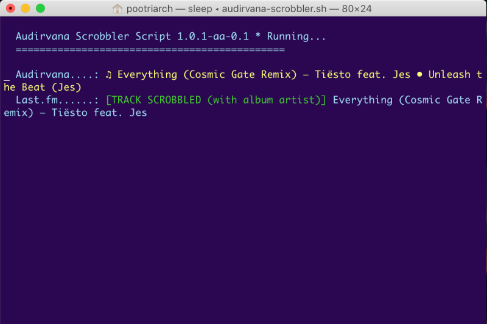

# Scrobbler EOL

---

With Audirvana moving to a subscription model, I will no longer maintain this project. It is unlikely to work with any version released in 2021 or later.

---

### audirvana-scrobbler (with album artist)

Scrobbles Audirvana playing tracks to last.fm.
This fork of `audirvana-scrobbler` takes album artist into account for local tracks.
The album artist is included with the scrobble if it's different from the track artist.

Uses zsh, AppleScript, and Python 3. This fork also uses
forked sibling repositories for [scrobbler](https://github.com/pootriarch/scrobbler/)
and [lfm](https://github.com/pootriarch/lfm/tree/1.1.2-album-artist)
that you'll need to install locally.

### Dependencies

#### Environment
* Audirvana
* macOS
* python3
* zsh

#### Unmodified packages
* media-info

#### Local packages
These packages aren't yet published; you'll need to clone and install locally.

* [scrobbler](https://github.com/pootriarch/scrobbler), fork of [original by hauzer](https://github.com/hauzer/scrobbler)
* [lfm v 1.1.2](https://github.com/pootriarch/lfm/tree/1.1.2-album-artist) (last.fm API integration), fork of [original by hauzer](https://github.com/hauzer/lfm). Requires v1.1.2, which is the only current version with album artist support.

### Installing

1. Clone [lfm v1.1.2](https://github.com/pootriarch/lfm/tree/1.1.2-album-artist), [scrobbler](https://github.com/pootriarch/scrobbler/),
and [audirvana-scrobbler](https://github.com/pootriarch/audirvana-scrobbler/) (this package)
from GitHub to your local filesystem.
1. Replace the API key in `lfm.py` with your own.
2. Inform `audirvana-scrobbler.sh` of your last.fm username either by changing the `LASTFM_USER` variable
in the script or by defining `LASTFM_USER` in your shell environment.
1. Install `lfm` with `pip3 install /path/to/lfm`
1. Install `scrobbler` with `pip3 install /path/to/scrobbler`
4. Install `media-info` using a package manager such as `brew` on macOS or `apt-get` on Unix.
2. Authenticate `scrobbler` to last.fm with `scrobbler add-user`.

### Usage

Place `audirvana-scrobbler.sh` at a location of your choosing; it need not be on your PATH.

Run it and leave its Terminal window open.

Play some music with Audirvana.

#### Default timings

Checks currently playing track every 10 seconds (`DEFAULT_SLEEP_TIME`).
The loop time increases to 20 seconds (`LONG_SLEEP_TIME`) if Audirvana has been idle for 5 minutes (`AUDIRVANA_IDLE_THRESHOLD`).

Scrobbles to Last.fm when 60% (`THRESHOLD`) of the track has been played.

Some of these values have been adjusted from the upstream project.

